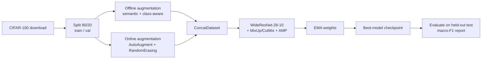

# CIFAR-100 Image Classification — WideResNet-28-10 + Semantic-Aware Augmentation

> **English** | [简体中文](./README.zh-CN.md)

A high-performance CIFAR-100 image-classification pipeline built for the **HKU DASC7606A-B** deep-learning assignment ([spec](https://github.com/hkukend/DASC7606A-B)). The task: take a baseline CIFAR-10 pipeline and turn it into a competitive CIFAR-100 classifier, graded on **macro-averaged F1** on a held-out test set.

## 🏆 Result

| Metric | Value |
|---|---|
| **Macro-averaged F1** | **83.2%** (≈ 0.832, held-out test set) |
| Grading metric | Macro-averaged F1 over the 100 classes |
| Rubric tiers | F1 ≥ 0.85 → 100%, F1 ≥ 0.80 → 90% |
| Backbone | WideResNet-28-10 (~36.5M params) |
| Compute | **~2.5 h end-to-end** on a single RTX 4080 Super (16 GB) — well within the 12 h budget |

The macro-F1 of 0.832 sits just below the 100%-tier threshold (F1 ≥ 0.85) and well above the 90% tier (F1 ≥ 0.80) — a near-maximal result for the assignment.

---

## ✨ Technical Highlights

The submission only touches the three files the assignment allows (`data_augmentation.py`, `model_architectures.py`, `train_utils.py`) plus `main.py` defaults, yet stacks a modern, well-regularized training recipe on top of a strong backbone.

| Area | What was done | Why it matters |
|---|---|---|
| **Backbone** | Pre-activation **WideResNet-28-10**, dropout 0.3, Kaiming init, adaptive pooling | The proven sweet-spot architecture for CIFAR-100 at 32×32 — high capacity without over-deep gradients |
| **Two-tier augmentation** | **Offline** semantic-aware (Albumentations) **+ online** (torchvision AutoAugment / RandomErasing) | Maximizes data diversity while keeping each epoch fresh |
| **Semantic class-aware aug** | Per-class & per-superclass enhancement routing + difficulty-scaled multipliers (stacked superclass × class factors, up to ~5× for the hardest classes) | Pours more, smarter augmentation into the *hard* classes |
| **Confusion-pair awareness** | Known confusable pairs (e.g. `bowl/plate`, `boy/girl`, `oak/maple`) get *reduced* mixing intensity | Avoids augmentation that would worsen the exact mistakes the model makes |
| **SmartRotation** | Rotation policy chosen by semantic class (free / 90°-180° / forbidden) | Prevents label-destroying rotations (a flipped `bus` is still a bus; a rotated `5`-like digit is not) |
| **MixUp + CutMix** | Batch-level, randomly selected per step (p = 0.5) | Strong regularization + implicit label smoothing |
| **Weight EMA** | Exponential moving average of weights, used for eval & export | Smoother, higher-accuracy final model |
| **Modern optimizer recipe** | SGD-Nesterov + warmup→cosine LR + label smoothing + **selective weight decay** (none on BN/bias) | Textbook best-practice schedule that squeezes out the last few F1 points |
| **Throughput & robustness** | AMP mixed precision, gradient clipping, NaN/Inf-loss guards | Finishes in ~2.5 h (vs. the 12 h budget) and never crashes mid-run |
| **Reproducibility** | Deterministic seeds, CuBLAS config, checkpoint state (optim/sched/scaler) | Same result every run; resumable |

---

## 🧭 Pipeline Architecture



**Data layout produced by the pipeline**

```
data/
├── raw/
│   ├── train/<class>/     # 40,000 imgs (80% of train)
│   ├── val/<class>/       # 10,000 imgs (20% of train)
│   └── test/<class>/      # 10,000 imgs (official test)
└── augmented/
    └── train/<class>/     # offline semantic-augmented copies
```

---

## 🔬 Deep Dive

### 1. Model — `scripts/model_architectures.py`
- **WideResNet-28-10** with *pre-activation* `BasicBlock`s (BN → ReLU → Conv), faithful to Zagoruyko & Komodakis (2016).
- Channel widths `[16, 160, 320, 640]`, dropout `0.3` inside residual blocks.
- Proper initialization: Kaiming (fan-out, ReLU) for conv, `γ=1/β=0` for BN, small-normal for the classifier.
- `adaptive_avg_pool2d` makes the network input-size agnostic.
- Fully configurable via env vars: `WRN_DEPTH`, `WRN_WIDTH`, `WRN_DROPOUT`.

### 2. Two-Tier Data Augmentation — `scripts/data_augmentation.py`
The most original part of the submission. It treats CIFAR-100's 20-superclass / 100-class hierarchy as a **semantic prior** for augmentation.

**Offline (Albumentations, materialized to disk):**
- A conservative-but-broad `BasicPipeline` (geometric / color / dropout / noise / distortion) tuned specifically for 32×32 images.
- **Difficulty-scaled multipliers** — each class's copy count is the *product* of a superclass factor × a class factor, so the hardest classes get the most copies: e.g. `boy/girl/baby` ≈ 2.0 × 2.5 = **5.0×**, `bowl/plate` ≈ 1.4 × 3.0 = **4.2×**, easy classes ≈ **1.4×**.
- **`ApplyTechniques`** — ~30 domain-specific CV enhancements routed by class/superclass: `face_enhancement` for people, `bark_texture/leaf_pattern` for trees, `petal/flower_color` for flowers, `vehicle_structure` for vehicles, `container_shape` for food containers, `marine_animal_texture`, `insect_detail`, etc.
- **`SmartRotation`** — rotation invariance encoded per superclass: free rotation for `fish/flowers/fruit/invertebrates`, 90°/180° for `aquatic_mammals/insects/reptiles/small_mammals`, **forbidden** for `people/vehicles/trees/furniture`.
- **Cross-sample (intra-class) & cross-class (inter-class) MixUp/CutMix**, where known **confusion pairs** get *halved* mixing strength to avoid amplifying hard mistakes.
- **`CacheManager`** — thread-safe, memory-bounded **LRU cache** (with hit-rate/eviction stats) that supplies mixing partners efficiently, with a `DatasetSampler` fallback.

**Online (torchvision, applied per-batch in the `DataLoader`):**
- `RandomCrop(32, padding=4, reflect)` → `RandomHorizontalFlip` → **`AutoAugment(CIFAR10)`** → `Normalize` → **`RandomErasing(p=0.5)`**.
- Combined with the offline set via `ConcatDataset`, so the model sees both a stable enriched corpus and fresh stochastic views each epoch.

### 3. Training Recipe — `scripts/train_utils.py`
- **Loss:** Label-Smoothing Cross-Entropy (`ε = 0.1`).
- **Batch-level MixUp (`α=0.4`) / CutMix (`α=1.0`)**, randomly chosen per step (`p=0.5`), with correctly mixed loss targets.
- **Weight EMA (`decay=0.999`)** — eval and the exported `final_model.pth` use EMA weights.
- **Optimizer:** SGD + Nesterov momentum `0.9` with weight decay applied **only to conv/fc weights** (BN & bias params excluded from L2).
- **LR schedule:** linear **warmup (5 ep)** → **cosine annealing** to `~0`.
- **Performance:** AMP (`autocast` + `GradScaler`), `pin_memory`, multi-worker loading.
- **Robustness:** gradient clipping (`max_norm=1.0`), NaN/Inf-loss skipping, scaler-underflow guarding.
- **Selection:** best checkpoint by validation loss, early stopping, resumable optimizer/scheduler/scaler state.

### 4. Evaluation — `scripts/evaluation_metrics.py`
The pipeline's `evaluate()` step produces scikit-learn's `classification_report` → **macro-averaged F1** (the grading metric). The module also ships ready-to-use analysis utilities — top-k accuracy, normalized confusion matrix, per-class ROC / PR curves, calibration curve, and correct/incorrect prediction galleries — which are available to call but are **not run automatically** by the default pipeline.

---

## 📦 Project Structure

```
cifar100-image-classification/
├── main.py                          # End-to-end pipeline & CLI (tuned defaults)
├── scripts/
│   ├── data_download.py             # CIFAR-10/100 download + 80/20 train-val split → folders
│   ├── data_augmentation.py         # Offline semantic-aware augmentation (the core innovation)
│   ├── model_architectures.py       # WideResNet-28-10
│   ├── train_utils.py               # Training loop, EMA, scheduler, MixUp/CutMix, AMP
│   └── evaluation_metrics.py        # Metrics & visualizations
├── pyproject.toml                   # Dependencies (managed with uv)
└── README.md
```

## 🚀 Installation

Requires **Python ≥ 3.13**. Dependencies are managed with [`uv`](https://github.com/astral-sh/uv).

```bash
# install uv if needed:  curl -LsSf https://astral.sh/uv/install.sh | sh
uv sync          # create venv & install from uv.lock
```

Or with pip:

```bash
pip install -e .
```

## ▶️ Usage

The whole pipeline (download → augment → train → evaluate) runs from `main.py`. Defaults are already tuned for the assignment:

```bash
uv run python main.py            # full run with tuned defaults

# or with overrides
uv run python main.py \
  --dataset cifar100 \
  --batch_size 256 \
  --num_epochs 30 \
  --lr 0.1 \
  --weight_decay 5e-4
```

The pipeline is **idempotent**: data download and offline augmentation are skipped if their output directories already exist.

### Key CLI arguments (`main.py`)

| Argument | Default | Description |
|---|---|---|
| `--dataset` | `cifar100` | `cifar10` or `cifar100` |
| `--batch_size` | `256` | Training batch size |
| `--num_epochs` | `30` | Training epochs (matches the cosine schedule's `TOTAL_EPOCHS`) |
| `--lr` | `0.1` | Base learning rate (SGD) |
| `--weight_decay` | `5e-4` | L2 penalty (excludes BN/bias) |
| `--offline_aug_count` | `5` | Base offline augmentations per image (scaled by class multiplier) |
| `--early_stopping_patience` | `30` | Patience on validation loss |
| `--seed` | `42` | Reproducibility seed |

### Tunable env-var knobs

The recipe exposes its hyperparameters via environment variables (with sensible defaults baked in):

| Variable | Default | Controls |
|---|---|---|
| `WRN_DEPTH` / `WRN_WIDTH` / `WRN_DROPOUT` | `28` / `10` / `0.3` | WideResNet shape |
| `WARMUP_EPOCHS` / `TOTAL_EPOCHS` | `5` / `30` | LR schedule |
| `MIXUP_ALPHA` / `CUTMIX_ALPHA` / `MIX_PROB` | `0.4` / `1.0` / `0.5` | Batch mixing |
| `LABEL_SMOOTHING` | `0.1` | Loss smoothing |
| `EMA_DECAY` | `0.999` | Weight EMA |
| `RANDOM_ERASING_PROB` | `0.5` | Online erasing |
| `USE_AMP` / `USE_MIXUP` / `USE_CUTMIX` / `USE_ONLINE_AUGMENTATION` | `1` | Feature toggles |

## 📊 Outputs

After a run you'll find:
- `results/models/best_model.pth` — best checkpoint (full state) by val loss
- `results/models/final_model.pth` — EMA-weighted final model for inference
- `training_metrics.txt` — per-class precision / recall / F1 (`classification_report`)
- `cifar_pipeline.log` — full run log

---

## 🙏 Acknowledgements & References

- Course scaffold: [DASC7606A-B](https://github.com/hkukend/DASC7606A-B) (HKU, MSc Data Science).
- **WideResNet:** Zagoruyko & Komodakis, *Wide Residual Networks*, BMVC 2016.
- **MixUp:** Zhang et al., *mixup: Beyond Empirical Risk Minimization*, ICLR 2018.
- **CutMix:** Yun et al., *CutMix*, ICCV 2019.
- **AutoAugment:** Cubuk et al., *AutoAugment*, CVPR 2019.
- **RandomErasing:** Zhong et al., AAAI 2020.
- Libraries: PyTorch, torchvision, Albumentations, scikit-learn.
```
