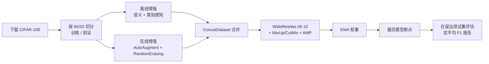

# CIFAR-100 图像分类 — WideResNet-28-10 + 语义感知数据增强

> [English](./README.md) | **简体中文**

面向 **香港大学 DASC7606A-B** 深度学习作业（[作业说明](https://github.com/hkukend/DASC7606A-B)）的高性能 CIFAR-100 图像分类流水线。任务目标：将基线 CIFAR-10 流水线改造为有竞争力的 CIFAR-100 分类器，并以留出测试集上的 **宏平均 F1（macro-F1）** 评分。

## 🏆 成绩

| 指标 | 数值 |
|---|---|
| **宏平均 F1** | **83.2%**（≈ 0.832，留出测试集） |
| 评分指标 | 100 个类别的宏平均 F1 |
| 评分档位 | F1 ≥ 0.85 → 100%，F1 ≥ 0.80 → 90% |
| 主干网络 | WideResNet-28-10（约 3650 万参数） |
| 算力 | 单卡 RTX 4080 Super（16 GB）端到端**约 2.5 小时**——远低于 12 小时预算 |

宏平均 F1 = 0.832，紧贴满分档（F1 ≥ 0.85）门槛之下，并显著高于 90% 档（F1 ≥ 0.80），是本作业接近满分的结果。

---

## ✨ 核心技术与创新点

提交内容仅修改作业允许的三个文件（`data_augmentation.py`、`model_architectures.py`、`train_utils.py`）及 `main.py` 默认参数，却在强主干之上叠加了一整套现代化、强正则的训练配方。

| 方向 | 做法 | 价值 |
|---|---|---|
| **主干网络** | 预激活 **WideResNet-28-10**，dropout 0.3，Kaiming 初始化，自适应池化 | 32×32 下 CIFAR-100 的经典最优结构——容量大且无过深梯度问题 |
| **两级数据增强** | **离线**语义感知（Albumentations）**+ 在线**（torchvision AutoAugment / RandomErasing） | 既最大化数据多样性，又保证每个 epoch 视图常新 |
| **语义类别感知增强** | 按类别/超类路由增强技术 + 难度自适应倍率（超类 × 类别因子累乘，最难类别最高约 5×） | 把更多、更聪明的增强投向**困难类别** |
| **混淆对感知** | 已知易混对（如 `bowl/plate`、`boy/girl`、`oak/maple`）降低混合强度 | 避免增强反而放大模型最常犯的错误 |
| **SmartRotation 智能旋转** | 按语义类别决定旋转策略（自由 / 90°-180° / 禁止） | 防止破坏标签的旋转（翻转的公交车仍是公交车，而被旋转的某些类别则不然） |
| **MixUp + CutMix** | 批级、每步随机择一（p = 0.5） | 强正则化 + 隐式标签平滑 |
| **权重 EMA** | 权重指数滑动平均，用于评估与导出 | 更平滑、精度更高的最终模型 |
| **现代优化配方** | SGD-Nesterov + warmup→cosine 学习率 + 标签平滑 + **选择性权重衰减**（BN/bias 不加衰减） | 教科书级最佳实践，榨出最后几分 F1 |
| **吞吐与鲁棒性** | AMP 混合精度、梯度裁剪、NaN/Inf 损失防护 | 约 2.5 小时完成（12 小时预算内），运行中绝不崩溃 |
| **可复现性** | 固定随机种子、CuBLAS 配置、断点状态（优化器/调度器/scaler） | 每次运行结果一致；可断点续训 |

---

## 🧭 流水线架构



**流水线生成的数据目录**

```
data/
├── raw/
│   ├── train/<类别>/     # 40,000 张（训练集 80%）
│   ├── val/<类别>/       # 10,000 张（训练集 20%）
│   └── test/<类别>/      # 10,000 张（官方测试集）
└── augmented/
    └── train/<类别>/     # 离线语义增强后的样本
```

---

## 🔬 技术细节

### 1. 模型 — `scripts/model_architectures.py`
- **WideResNet-28-10**，采用*预激活* `BasicBlock`（BN → ReLU → Conv），忠实复现 Zagoruyko & Komodakis（2016）。
- 通道宽度 `[16, 160, 320, 640]`，残差块内 dropout `0.3`。
- 规范初始化：卷积用 Kaiming（fan-out, ReLU），BN 用 `γ=1/β=0`，分类头用小标准差正态。
- `adaptive_avg_pool2d` 使网络对输入尺寸无关。
- 通过环境变量完全可配：`WRN_DEPTH`、`WRN_WIDTH`、`WRN_DROPOUT`。

### 2. 两级数据增强 — `scripts/data_augmentation.py`
提交中最具原创性的部分。它将 CIFAR-100 的 20 超类 / 100 类层次结构当作增强的**语义先验**。

**离线（Albumentations，落盘物化）：**
- 一条针对 32×32 精心调校、保守而全面的 `BasicPipeline`（几何 / 颜色 / dropout / 噪声 / 形变）。
- **难度自适应倍率**——每个类别的副本数是「超类因子 × 类别因子」的**乘积**，因此最难的类别副本最多：如 `boy/girl/baby` ≈ 2.0 × 2.5 = **5.0×**，`bowl/plate` ≈ 1.4 × 3.0 = **4.2×**，简单类别 ≈ **1.4×**。
- **`ApplyTechniques`**——约 30 种按类别/超类路由的领域特定 CV 增强：人物用 `face_enhancement`、树木用 `bark_texture/leaf_pattern`、花卉用 `petal/flower_color`、车辆用 `vehicle_structure`、食物容器用 `container_shape`、还有 `marine_animal_texture`、`insect_detail` 等。
- **`SmartRotation`**——按超类编码旋转不变性：`fish/flowers/fruit/invertebrates` 可自由旋转，`aquatic_mammals/insects/reptiles/small_mammals` 仅 90°/180°，`people/vehicles/trees/furniture` **禁止**旋转。
- **同类（cross-sample）与跨类（cross-class）的 MixUp/CutMix**，其中已知**混淆对**的混合强度*减半*，避免放大困难错误。
- **`CacheManager`**——线程安全、内存受限的 **LRU 缓存**（带命中率/淘汰统计），高效提供混合配对样本，并以 `DatasetSampler` 作回退。

**在线（torchvision，在 `DataLoader` 中逐批应用）：**
- `RandomCrop(32, padding=4, reflect)` → `RandomHorizontalFlip` → **`AutoAugment(CIFAR10)`** → `Normalize` → **`RandomErasing(p=0.5)`**。
- 经 `ConcatDataset` 与离线集合并，使模型每个 epoch 既能见到稳定且丰富的语料，又能见到全新的随机视图。

### 3. 训练配方 — `scripts/train_utils.py`
- **损失：** 标签平滑交叉熵（`ε = 0.1`）。
- **批级 MixUp（`α=0.4`）/ CutMix（`α=1.0`）**，每步随机择一（`p=0.5`），损失目标正确混合。
- **权重 EMA（`decay=0.999`）**——评估与导出的 `final_model.pth` 均使用 EMA 权重。
- **优化器：** SGD + Nesterov 动量 `0.9`，权重衰减**仅作用于 conv/fc 权重**（BN 与 bias 不计入 L2）。
- **学习率调度：** 线性 **warmup（5 个 epoch）** → **余弦退火**至 `~0`。
- **性能：** AMP（`autocast` + `GradScaler`）、`pin_memory`、多进程加载。
- **鲁棒性：** 梯度裁剪（`max_norm=1.0`）、NaN/Inf 损失跳过、scaler 下溢防护。
- **选择：** 按验证损失保存最优断点、早停、可续训的优化器/调度器/scaler 状态。

### 4. 评估 — `scripts/evaluation_metrics.py`
流水线的 `evaluate()` 步骤产出 scikit-learn 的 `classification_report` → **宏平均 F1**（评分指标）。该模块另外提供了开箱即用的分析工具——Top-k 准确率、归一化混淆矩阵、逐类 ROC / PR 曲线、置信度校准曲线，以及正确/错误预测样本展示——这些函数可供调用，但**默认流水线不会自动运行**。

---

## 📦 项目结构

```
cifar100-image-classification/
├── main.py                          # 端到端流水线与命令行（已调优默认值）
├── scripts/
│   ├── data_download.py             # CIFAR-10/100 下载 + 80/20 训练-验证切分 → 文件夹
│   ├── data_augmentation.py         # 离线语义感知增强（核心创新）
│   ├── model_architectures.py       # WideResNet-28-10
│   ├── train_utils.py               # 训练循环、EMA、调度器、MixUp/CutMix、AMP
│   └── evaluation_metrics.py        # 指标与可视化
├── pyproject.toml                   # 依赖（使用 uv 管理）
└── README.md
```

## 🚀 安装

需要 **Python ≥ 3.13**。依赖使用 [`uv`](https://github.com/astral-sh/uv) 管理。

```bash
# 如未安装 uv：  curl -LsSf https://astral.sh/uv/install.sh | sh
uv sync          # 创建虚拟环境并按 uv.lock 安装
```

或使用 pip：

```bash
pip install -e .
```

## ▶️ 使用方法

整条流水线（下载 → 增强 → 训练 → 评估）由 `main.py` 驱动，默认值已针对作业调优：

```bash
uv run python main.py            # 使用调优默认值完整运行

# 或自定义覆盖
uv run python main.py \
  --dataset cifar100 \
  --batch_size 256 \
  --num_epochs 30 \
  --lr 0.1 \
  --weight_decay 5e-4
```

流水线具有**幂等性**：若输出目录已存在，数据下载与离线增强会自动跳过。

### 主要命令行参数（`main.py`）

| 参数 | 默认值 | 说明 |
|---|---|---|
| `--dataset` | `cifar100` | `cifar10` 或 `cifar100` |
| `--batch_size` | `256` | 训练批大小 |
| `--num_epochs` | `30` | 训练轮数（与余弦调度的 `TOTAL_EPOCHS` 对应） |
| `--lr` | `0.1` | 基础学习率（SGD） |
| `--weight_decay` | `5e-4` | L2 惩罚（不含 BN/bias） |
| `--offline_aug_count` | `5` | 每张图基础离线增强数（按类别倍率缩放） |
| `--early_stopping_patience` | `30` | 验证损失早停耐心值 |
| `--seed` | `42` | 复现随机种子 |

### 可调环境变量

训练配方通过环境变量暴露其超参数（已内置合理默认值）：

| 变量 | 默认值 | 控制对象 |
|---|---|---|
| `WRN_DEPTH` / `WRN_WIDTH` / `WRN_DROPOUT` | `28` / `10` / `0.3` | WideResNet 形状 |
| `WARMUP_EPOCHS` / `TOTAL_EPOCHS` | `5` / `30` | 学习率调度 |
| `MIXUP_ALPHA` / `CUTMIX_ALPHA` / `MIX_PROB` | `0.4` / `1.0` / `0.5` | 批级混合 |
| `LABEL_SMOOTHING` | `0.1` | 损失平滑 |
| `EMA_DECAY` | `0.999` | 权重 EMA |
| `RANDOM_ERASING_PROB` | `0.5` | 在线擦除 |
| `USE_AMP` / `USE_MIXUP` / `USE_CUTMIX` / `USE_ONLINE_AUGMENTATION` | `1` | 功能开关 |

## 📊 输出产物

运行后将生成：
- `results/models/best_model.pth` —— 按验证损失保存的最优断点（完整状态）
- `results/models/final_model.pth` —— 用于推理的 EMA 加权最终模型
- `training_metrics.txt` —— 逐类 precision / recall / F1（`classification_report`）
- `cifar_pipeline.log` —— 完整运行日志

---

## 🙏 致谢与参考

- 课程脚手架：[DASC7606A-B](https://github.com/hkukend/DASC7606A-B)（香港大学数据科学硕士）。
- **WideResNet：** Zagoruyko & Komodakis, *Wide Residual Networks*, BMVC 2016.
- **MixUp：** Zhang et al., *mixup: Beyond Empirical Risk Minimization*, ICLR 2018.
- **CutMix：** Yun et al., *CutMix*, ICCV 2019.
- **AutoAugment：** Cubuk et al., *AutoAugment*, CVPR 2019.
- **RandomErasing：** Zhong et al., AAAI 2020.
- 库：PyTorch、torchvision、Albumentations、scikit-learn。
```
